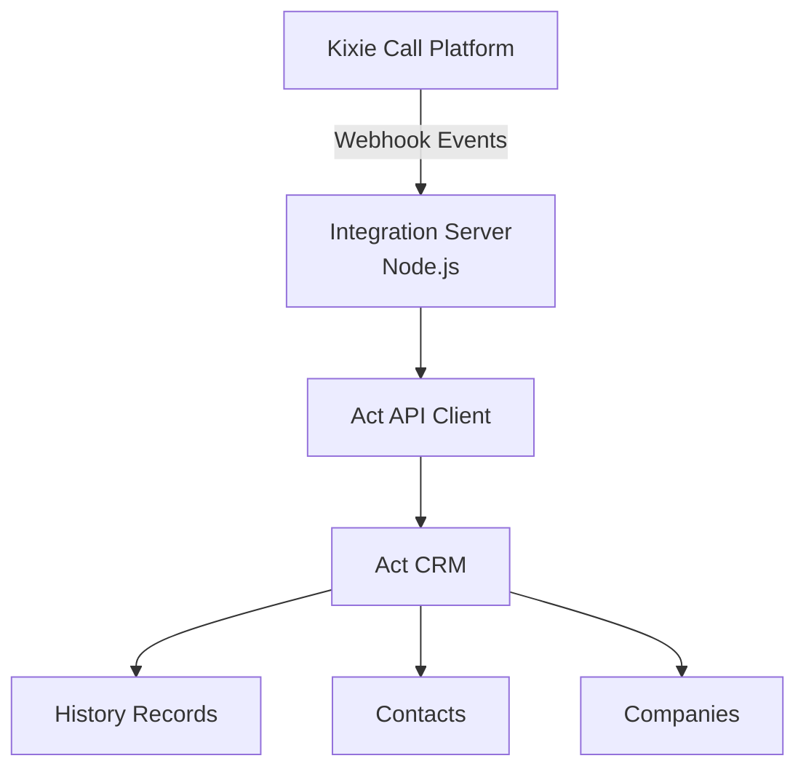

# Kixie ↔ Act! CRM Integration

Integration service that logs Kixie calls and SMS activity into Act! CRM.

Domain

https://integration.johnsonads.com

---

# Purpose

This integration connects **Kixie** with **Act! CRM** to automatically record communication activity and enable automation workflows inside the CRM.

The service receives **webhooks from Kixie**, processes the payload, and writes structured records to Act using the **Act Web API**.

---

# System Architecture

---

# Core Features

The integration currently supports or plans to support the following capabilities.

Call logging

Automatically logs phone calls into Act History records.

SMS logging

Stores SMS conversations as CRM activity records.

Transcript generation

Captures call transcripts for reporting and analysis.

Conversation intelligence tagging

AI-generated tags for call topics and outcomes.

Disposition tracking

Maps Kixie call dispositions to the Act History Result field.

Follow-up automation

Triggers CRM automation based on call outcomes or sentiment.

Admin dashboard APIs

Internal APIs used for monitoring and administration.

---

# Call Logging Flow

Call occurs in Kixie  
↓  
Kixie webhook sent  
↓  
Integration server receives payload  
↓  
Contact or company located in Act  
↓  
POST /api/history  
↓  
History record created in Act  

---

# History Fields Written

Standard fields

Subject  
HistoryType  
Result  
StartDate  
EndDate  

Custom fields

Kixie_Call_ID  
Recording_URL  
CI_Summary  
Sentiment  
Conversation_Strength  
Keywords  
Call_Direction  

---

# Repository Structure

kixie-act-integration
│
├── docs
│   └── architecture.md
│
├── src
│   ├── routes
│   │   └── kixieWebhook.ts
│   │
│   ├── services
│   │   ├── actAuth.ts
│   │   ├── actLookup.ts
│   │   └── actHistoryLogger.ts
│
├── PROJECT_STATE.md
├── package.json
└── README.md

---

# Security

Never commit:

.env  
API credentials  
CRM tokens  

All secrets must remain in environment variables.

---

# Status

Webhook integration working  
Call logging confirmed  

Next improvements:

Duplicate call protection  
Improved logging  
Retry handling for API failures  
Enhanced phone matching logic

