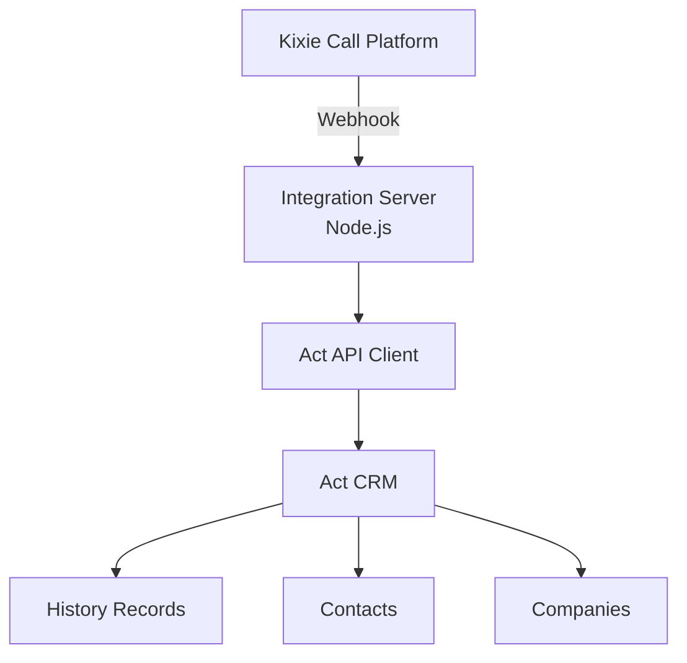

# Integration Architecture
Kixie ↔ Act CRM Integration

Last Updated: 2026-03-12

---

# System Overview

This service logs phone calls from Kixie into Act CRM as History records.

The integration acts as middleware between the Kixie webhook system and the Act Web API.

---

# High-Level Architecture

---

# Call Logging Flow

Call occurs in Kixie  
↓  
Webhook sent to integration server  
↓  
Webhook payload processed  
↓  
Contact or Company located in Act  
↓  
History record created via Act API  

---

# Act Endpoint Used

POST /api/history

This endpoint records completed actions in Act.

---

# History Record Fields

Subject

Call

HistoryType

Call

Result

Call disposition

StartDate

Call start time

EndDate

Call end time

---

# Custom Fields Written

Kixie_Call_ID

Recording_URL

CI_Summary

Sentiment

Conversation_Strength

Keywords

Call_Direction

---

# Duplicate Protection (Planned)

Before creating a new history record the system will check if the Kixie_Call_ID already exists.

If it exists the record will not be recreated.

---

# Repository Structure

kixie-act-integration
│
├── docs
│   └── architecture.md
│
├── src
│   ├── routes
│   │   └── kixieWebhook.ts
│   │
│   ├── services
│   │   ├── actAuth.ts
│   │   ├── actLookup.ts
│   │   └── actHistoryLogger.ts
│
├── PROJECT_STATE.md
├── package.json
└── README.md

---

# System Status

Webhook integration active.

Call logging to Act confirmed.

Future work includes duplicate protection and enhanced logging.

